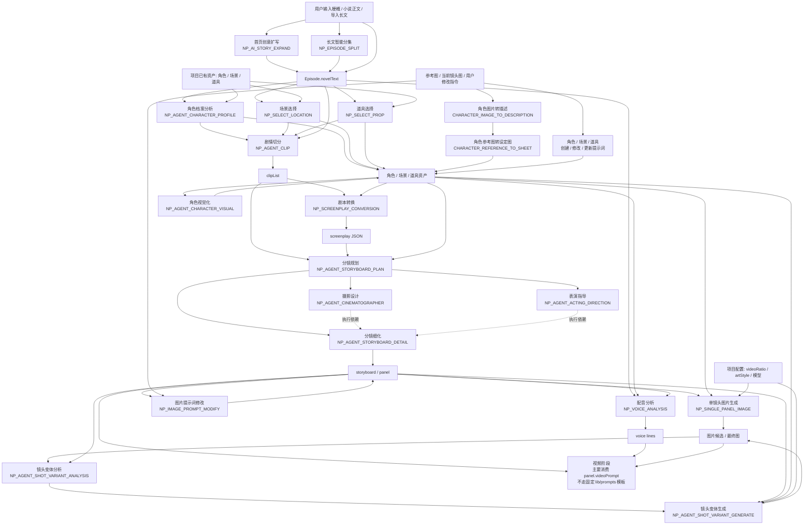
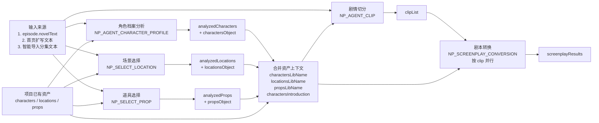
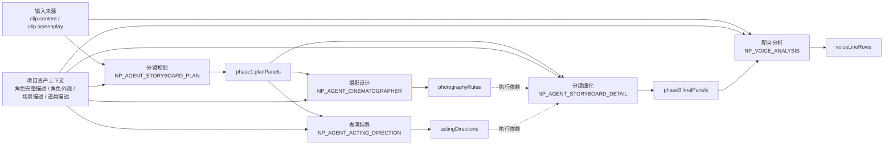
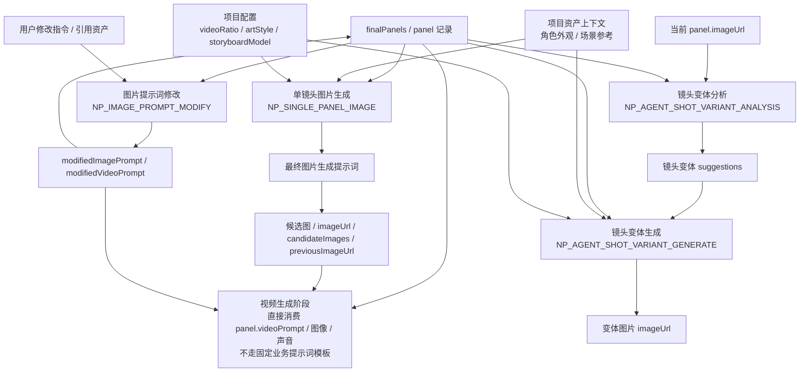
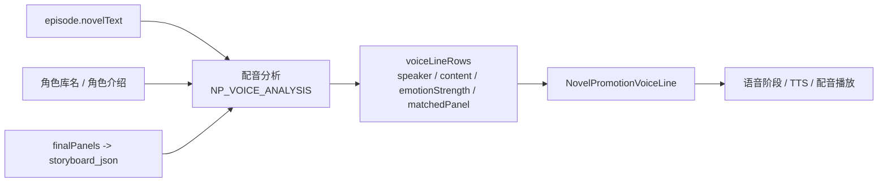
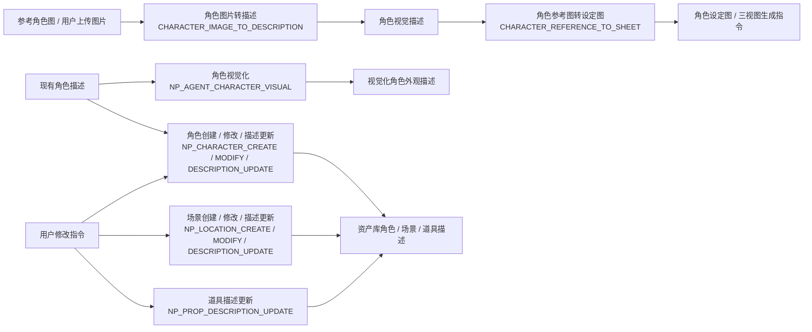

# 提示词承接流程图与输入输出产物

## 1. 这份图怎么看

这份文档只关注三件事：

- 提示词之间是如何承接的
- 每个提示词的输入来源是什么
- 每个提示词的输出最终落成了什么产物

这里的“产物”分成三层：

- 提示词直接输出的结构化 JSON / 文本
- Run Runtime 中记录的 artifact
- 数据库或媒体存储中的最终落地结果

---

## 2. 总体主链路

---

## 3. Story to Script：提示词承接图

### 3.1 Story to Script 输入来源

| 提示词 | 主要输入来源 | 关键变量 | 直接输出 |
| --- | --- | --- | --- |
| 角色档案分析（`NP_AGENT_CHARACTER_PROFILE`） | `episode.novelText`、已有角色库 | `input`、`characters_lib_info` | 角色档案 JSON |
| 场景选择（`NP_SELECT_LOCATION`） | `episode.novelText`、已有场景库 | `input`、`locations_lib_name` | 场景列表 JSON |
| 道具选择（`NP_SELECT_PROP`） | `episode.novelText`、已有道具库 | `input`、`props_lib_name` | 道具列表 JSON |
| 剧情切分（`NP_AGENT_CLIP`） | 原始故事全文、角色/场景/道具上下文 | `input`、`characters_lib_name`、`locations_lib_name`、`props_lib_name`、`characters_introduction` | `clipList` |
| 剧本转换（`NP_SCREENPLAY_CONVERSION`） | 单个 `clip.content`、角色/场景/道具上下文 | `clip_content`、`characters_lib_name`、`locations_lib_name`、`props_lib_name`、`characters_introduction`、`clip_id` | 单个 clip 的 screenplay JSON |

### 3.2 Story to Script 输出产物

| 阶段 | Run Artifact | 最终落库 |
| --- | --- | --- |
| 角色分析 | `analysis.characters` | 项目角色资产 |
| 场景分析 | `analysis.locations` | 项目场景资产 |
| 道具分析 | `analysis.props` | 项目道具资产 |
| clip 切分 | `clips.split` | `NovelPromotionClip` |
| screenplay 转换 | `screenplay.clip` | `NovelPromotionClip.screenplay` |

### 3.3 关键承接关系

1. 角色档案分析（`NP_AGENT_CHARACTER_PROFILE`）、场景选择（`NP_SELECT_LOCATION`）、道具选择（`NP_SELECT_PROP`）先并行执行。
2. 三者输出不会直接原样继续下传，而是先被整理成：
   - `charactersLibName`
   - `locationsLibName`
   - `propsLibName`
   - `charactersIntroduction`
3. 剧情切分（`NP_AGENT_CLIP`）吃的是“原始全文 + 合并后的资产上下文”。
4. 剧本转换（`NP_SCREENPLAY_CONVERSION`）不再吃全文，而是按 `clipList` 中每个 clip 并行执行。

---

## 4. Script to Storyboard：提示词承接图

### 4.1 Script to Storyboard 输入来源

| 提示词 | 主要输入来源 | 关键变量 | 直接输出 |
| --- | --- | --- | --- |
| 分镜规划（`NP_AGENT_STORYBOARD_PLAN`） | `clip.content` 或 `clip.screenplay`、角色外观、角色完整描述、场景描述、道具描述 | `clip_json`、`clip_content`、`characters_appearance_list`、`characters_full_description`、`locations_lib_name`、`props_description` | `planPanels` |
| 摄影设计（`NP_AGENT_CINEMATOGRAPHER`） | `planPanels`、角色完整描述、场景描述、道具描述 | `panels_json`、`panel_count`、`locations_description`、`characters_info`、`props_description` | 摄影规则数组 |
| 表演指导（`NP_AGENT_ACTING_DIRECTION`） | `planPanels`、角色完整描述 | `panels_json`、`panel_count`、`characters_info` | 表演指令数组 |
| 分镜细化（`NP_AGENT_STORYBOARD_DETAIL`） | `planPanels`、角色完整描述、场景描述、道具描述 | `panels_json`、`characters_age_gender`、`locations_description`、`props_description` | 最终 `finalPanels` |
| 配音分析（`NP_VOICE_ANALYSIS`） | 原始故事文本、角色介绍、最终 storyboard JSON | `input`、`characters_lib_name`、`characters_introduction`、`storyboard_json` | `voiceLineRows` |

### 4.2 Script to Storyboard 输出产物

| 阶段 | Run Artifact | 最终落库 |
| --- | --- | --- |
| Phase 1 规划 | `storyboard.clip.phase1` | 暂不直接落最终表，仅作为中间产物 |
| Phase 2 摄影 | `storyboard.clip.phase2.cine` | 暂不直接落最终表，仅作为中间产物 |
| Phase 2 表演 | `storyboard.clip.phase2.acting` | 暂不直接落最终表，仅作为中间产物 |
| Phase 3 细化 | `storyboard.clip.phase3` | `NovelPromotionStoryboard` + `NovelPromotionPanel` |
| 台词分析 | `voice.lines` | `NovelPromotionVoiceLine` |

### 4.3 当前代码中的一个重要现状

当前代码里，分镜细化（`NP_AGENT_STORYBOARD_DETAIL`）在执行依赖上会等待：

- 摄影设计（`NP_AGENT_CINEMATOGRAPHER`）
- 表演指导（`NP_AGENT_ACTING_DIRECTION`）

但是从实际模板变量注入看，Phase 3 提示词目前直接吃的是：

- `planPanels`
- 角色完整描述
- 场景描述
- 道具描述

并没有把 Phase 2 的 `photographyRules` / `actingDirections` 显式注入提示词变量。

也就是说，当前链路更准确地说是：

- 执行时序上：`Phase1 -> (Phase2 摄影, Phase2 表演) -> Phase3`
- 提示词数据输入上：`Phase3` 目前主要还是吃 `Phase1 + 资产上下文`

这是后续重构时非常值得优先处理的点。

---

## 5. 图片、镜头提示词、变体、视频支线

### 5.1 这条支线的承接方式

| 提示词 | 输入来源 | 输出 | 最终落地 |
| --- | --- | --- | --- |
| 单镜头图片生成（`NP_SINGLE_PANEL_IMAGE`） | `panel.description`、`panel.videoPrompt`、角色外观、场景参考、`videoRatio`、`artStyle` | 最终图片生成提示词字符串 | 候选图上传后写回 `NovelPromotionPanel.imageUrl / candidateImages / previousImageUrl` |
| 图片提示词修改（`NP_IMAGE_PROMPT_MODIFY`） | 当前 `imagePrompt`、当前 `videoPrompt`、用户修改指令、引用资产描述 | `modifiedImagePrompt`、`modifiedVideoPrompt` | 通常由上层 mutation / route 写回 panel 提示词字段 |
| 镜头变体分析（`NP_AGENT_SHOT_VARIANT_ANALYSIS`） | 当前 panel 的图片、描述、镜头类型、机位、角色信息 | 镜头变体建议数组 | 前端供用户选变体 |
| 镜头变体生成（`NP_AGENT_SHOT_VARIANT_GENERATE`） | 源 panel、用户选中的变体、角色参考图、场景参考、比例、风格 | 变体图片生成提示词 -> 最终变体图 | 写回新的 `NovelPromotionPanel.imageUrl` |

### 5.2 视频阶段的现实情况

当前视频阶段主要消费的是：

- `NovelPromotionPanel.videoPrompt`
- 面板图像
- 角色 / 场景上下文
- 声音和口型同步信息

但它**没有一个固定注册在 `lib/prompts` 里的统一业务提示词模板**。  
因此从“提示词工程化重构”的角度看，视频阶段目前更像是“消费上游结果”的模型调用层，而不是本项目提示词主链的一部分。

---

## 6. 配音支线

### 6.1 输出字段层面

配音分析（`NP_VOICE_ANALYSIS`）的核心输出不是纯文本，而是一组结构化 voice line，至少包括：

- `lineIndex`
- `speaker`
- `content`
- `emotionStrength`
- `matchedPanel`

随后再落到 `NovelPromotionVoiceLine`，供后续语音阶段继续生成声音。

---

## 7. 角色参考图与资产库支线

### 7.1 这条支线的作用

它不直接推进主剧情链路，但会不断反哺主链：

- 给 Story to Script 提供已有角色 / 场景 / 道具库
- 给 Storyboard 提供角色外观和场景描述
- 给图片和镜头变体生成提供参考图和描述

---

## 8. 输入来源总表

| 输入来源类型 | 具体来源 | 典型被谁消费 |
| --- | --- | --- |
| 用户原始文本 | 首页梗概、小说正文、导入长文 | 首页创意扩写（`NP_AI_STORY_EXPAND`）、长文智能分集（`NP_EPISODE_SPLIT`）、Story to Script、配音分析（`NP_VOICE_ANALYSIS`） |
| 项目配置 | `videoRatio`、`artStyle`、模型配置 | 单镜头图片生成（`NP_SINGLE_PANEL_IMAGE`）、镜头变体生成、视频阶段 |
| 项目资产 | 项目角色、场景、道具、角色外观 | Story to Script、Storyboard、图片生成、镜头提示词修改 |
| 上游提示词产物 | `clipList`、`screenplay`、`planPanels`、`finalPanels`、`voiceLineRows` | 下游各阶段提示词和媒体生成阶段 |
| 当前镜头状态 | `panel.description`、`imagePrompt`、`videoPrompt`、`imageUrl` | 单镜头图片生成（`NP_SINGLE_PANEL_IMAGE`）、图片提示词修改（`NP_IMAGE_PROMPT_MODIFY`）、镜头变体分析（`NP_AGENT_SHOT_VARIANT_ANALYSIS`） |
| 参考图 | 角色参考图、场景参考图、镜头当前图 | 角色图片转描述（`CHARACTER_IMAGE_TO_DESCRIPTION`）、镜头变体分析 / 生成、图片生成 |
| 用户修改指令 | 修改提示词、修改角色 / 场景 / 道具描述 | 图片提示词修改（`NP_IMAGE_PROMPT_MODIFY`）、各类修改 / 更新提示词 |

---

## 9. 输出产物总表

| 产物层级 | 产物 | 说明 |
| --- | --- | --- |
| 中间提示词输出 | 角色档案、场景列表、道具列表、`clipList`、screenplay JSON、`planPanels`、摄影规则、表演指令、`finalPanels`、`voiceLineRows` | 这是提示词直接吐出的结构化数据 |
| Run Artifact | `analysis.characters`、`analysis.locations`、`analysis.props`、`clips.split`、`screenplay.clip`、`storyboard.clip.phase1`、`storyboard.clip.phase2.cine`、`storyboard.clip.phase2.acting`、`storyboard.clip.phase3`、`voice.lines` | 这是运行时追踪和重试的中间产物 |
| 数据库实体 | 角色 / 场景 / 道具资产、`NovelPromotionClip`、`NovelPromotionStoryboard`、`NovelPromotionPanel`、`NovelPromotionVoiceLine` | 这是最终业务数据 |
| 媒体文件 | `imageUrl`、`candidateImages`、`previousImageUrl`、后续视频和音频文件 | 这是最终媒体输出 |

---

## 10. 如果你要重构，最值得先拆的几个“承接点”

### 10.1 Story to Script 的标准中间层

建议把下面几个对象明确提成统一 schema：

- `AnalyzedCharacters`
- `AnalyzedLocations`
- `AnalyzedProps`
- `ClipList`
- `Screenplay`

因为它们已经在代码里充当“跨提示词的标准承接物”。

### 10.2 Storyboard 三阶段的中间层

建议显式区分：

- `StoryboardPlanPanels`
- `PhotographyRules`
- `ActingDirections`
- `FinalStoryboardPanels`

尤其是目前 Phase 2 输出没有被显式注入 Phase 3，这说明：

- 要么把 Phase 2 合并进 Phase 3
- 要么把 Phase 2 输出真正结构化注入 Phase 3 提示词

否则它们现在更像“记录了，但没有充分参与最终生成”的旁路产物。

### 10.3 图片 / 视频阶段的边界

目前图片阶段的提示词工程化程度高于视频阶段。  
如果后续要统一重构，建议把视频阶段也抽成：

- 画面转视频提示词（`PanelToVideoPrompt`）
- 视频变体提示词（`VideoVariationPrompt`）
- 口型同步提示词（`LipSyncPrompt`）

即使底层模型调用差异很大，也至少要把“业务输入 / 输出结构”固定下来。

---

## 11. 一句话总结

当前项目的提示词主链可以概括为：

**故事文本 -> 资产分析提示词 -> 剧情切分提示词 -> 剧本转换提示词 -> 分镜规划 / 摄影设计 / 表演指导 / 分镜细化提示词 -> 配音 / 图片 / 变体支线 -> 视频消费层**

而真正串起这些提示词的，不是单个字符串，而是一组不断演化的中间结构化产物：

- 资产分析结果
- clipList
- screenplay
- planPanels
- finalPanels
- voiceLineRows
